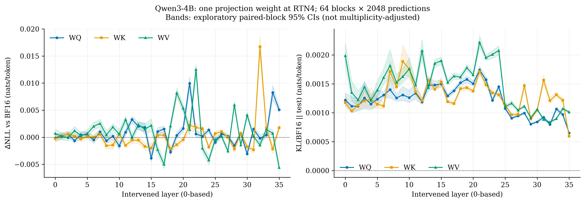
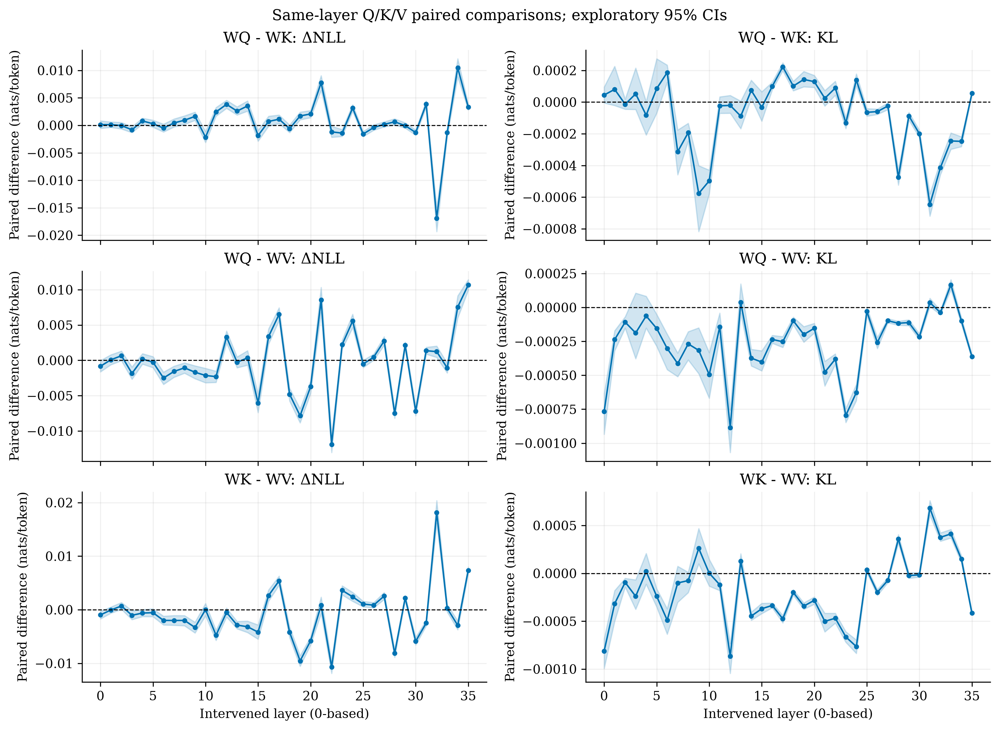
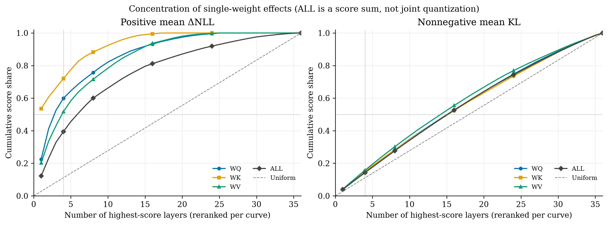

# Qwen3-4B 逐層 projection-weight 敏感度

## 結果與範圍

**109/109 真實條件 = BF16 + 108 次單層/單projection RTN4介入；6976逐block列，每條件64 blocks ×2048預測位置。** 層號均0-based。
BF16 NLL **2.622361980**、PPL **13.768205**；本輪64個block的BF16 NLL與歷史2048條件逐筆完全相同。
沿用原checkpoint/tokenizer、相同64 blocks、row內group128對稱RTN、FP32 scale與metric reduction，dequant後BF16前向。KL方向為 `P_BF16 || P_test`。
每次只改一個weight；沒有量化activations或KV。GQA的Q參數量為K/V四倍，不是等參數或等成本比較。沒有packed low-bit GEMM/加速/記憶體壓縮宣稱。

## 是否集中在少數層？

下表是**描述性集中度**：先算每層64 blocks的平均，再取非負分數 `max(mean metric,0)`；原始負ΔNLL仍完整保留，沒有刪掉或改写測量。
ALL把同一層Q/K/V三個獨立介入的分數相加，只用於layer排行，**不是三者聯合介入的測量，不能假設損害可加**。
預先固定top4（36層約11%）占比≥50%為『高度集中』的描述性參考，不是假設檢定/普遍門檻。effective layers=(Σs)²/Σs²；均勻36層時為36。
top4 CI每次以相同block索引重抽全部層並重新排名，不固定事後挑出的top層。

| 分數 | projection | top1占比 | top4占比 [95% CI] | top8占比 | 50%/80%所需層數 | effective layers [95% CI] | top4層 |
|---|---|---:|---|---:|---|---|---|
| delta_nll | WQ | 22.4% | 59.9% [53.0%, 67.3%] | 75.7% | 3 / 10 | 8.72 [7.04, 10.70] | 21, 34, 35, 12 |
| delta_nll | WK | 53.5% | 72.0% [64.5%, 79.5%] | 88.3% | 1 / 6 | 3.26 [2.66, 4.21] | 32, 21, 22, 35 |
| delta_nll | WV | 20.2% | 51.7% [47.2%, 55.6%] | 71.5% | 4 / 11 | 10.82 [9.51, 12.48] | 22, 19, 28, 20 |
| delta_nll | ALL | 12.2% | 39.4% [35.6%, 42.9%] | 60.0% | 6 / 16 | 16.87 [14.85, 19.32] | 32, 22, 21, 34 |
| kl | WQ | 4.0% | 14.6% [14.3%, 15.0%] | 28.2% | 16 / 27 | 34.50 [34.34, 34.57] | 21, 19, 22, 18 |
| kl | WK | 4.0% | 15.1% [14.5%, 15.9%] | 28.3% | 16 / 27 | 34.61 [34.33, 34.73] | 9, 10, 21, 7 |
| kl | WV | 4.2% | 15.7% [15.6%, 16.1%] | 30.2% | 15 / 26 | 33.67 [33.47, 33.79] | 21, 24, 12, 23 |
| kl | ALL | 3.9% | 14.3% [14.1%, 14.6%] | 27.6% | 16 / 27 | 34.64 [34.50, 34.72] | 21, 22, 7, 15 |

### 有限結論

- ALL delta_nll：top4層 [32, 22, 21, 34] 占 39.4%，不符合預先固定的高度集中描述性參考；達80%需 16 層。不能只憑均值top層宣稱跨資料可重現。
- WQ delta_nll 最大4層：L21=+0.0099606; L34=+0.0082787; L35=+0.0050920; L12=+0.0032698。
- WK delta_nll 最大4層：L32=+0.0167328; L21=+0.0022207; L22=+0.0018082; L35=+0.0017658。
- WV delta_nll 最大4層：L22=+0.0125130; L19=+0.0081728; L28=+0.0059733; L20=+0.0053438。
- delta_nll 的36層Q/K/V均值排序頻數：WK > WQ > WV: 5層；WK > WV > WQ: 3層；WQ > WK > WV: 6層；WQ > WV > WK: 6層；WV > WK > WQ: 6層；WV > WQ > WK: 10層。這是描述性排序，不是每層差異已被確認。
- delta_nll 的108個同層Q/K/V配對CI有 25 個跨零；跨零不是證明等價，不追求一致排序或追加條件。
- ALL kl：top4層 [21, 22, 7, 15] 占 14.3%，不符合預先固定的高度集中描述性參考；達80%需 27 層。不能只憑均值top層宣稱跨資料可重現。
- WQ kl 最大4層：L21=+0.0017395; L19=+0.0015778; L22=+0.0015715; L18=+0.0015185。
- WK kl 最大4層：L09=+0.0018858; L10=+0.0017587; L21=+0.0017155; L07=+0.0017137。
- WV kl 最大4層：L21=+0.0022171; L24=+0.0020759; L12=+0.0020736; L23=+0.0020101。
- kl 的36層Q/K/V均值排序頻數：WK > WQ > WV: 3層；WK > WV > WQ: 7層；WV > WK > WQ: 11層；WV > WQ > WK: 15層。這是描述性排序，不是每層差異已被確認。
- kl 的108個同層Q/K/V配對CI有 21 個跨零；跨零不是證明等價，不追求一致排序或追加條件。
- 40/108 介入平均ΔNLL為負。這是固定語料上的局部改善/數值效應，不能解釋成普遍有益；KL和ΔNLL須分開判讀。





## 完整逐層摘要

單位nats/token；表中NLL是所有131072預測位置的平均（由等長64 block NLL以FP64彙總），PPL=exp(mean NLL)，不平均block PPL。
全部108介入的vs-BF16探索性CI在 `layer_summary.csv`，全部216個Q/K/V contrast/metric在 `paired_comparisons.csv`。

| layer | projection | NLL | PPL | ΔNLL [95% CI] | KL [95% CI] |
|---:|---|---:|---:|---|---|
| -1 | none | 2.62236198 | 13.768205 | +0.00000000 [+0.00000000, +0.00000000] | 0.00000000 [0.00000000, 0.00000000] |
| 0 | WQ | 2.62223826 | 13.766502 | -0.00012372 [-0.00071120, +0.00048770] | 0.00121984 [0.00113309, 0.00134137] |
| 0 | WK | 2.62211243 | 13.764770 | -0.00024955 [-0.00089235, +0.00043416] | 0.00117524 [0.00109345, 0.00130779] |
| 0 | WV | 2.62307205 | 13.777985 | +0.00071007 [-0.00010031, +0.00150377] | 0.00198744 [0.00181572, 0.00220580] |
| 1 | WQ | 2.62262725 | 13.771858 | +0.00026527 [-0.00025205, +0.00079149] | 0.00111314 [0.00100074, 0.00127457] |
| 1 | WK | 2.62250055 | 13.770113 | +0.00013857 [-0.00040407, +0.00072678] | 0.00103275 [0.00100407, 0.00106830] |
| 1 | WV | 2.62254324 | 13.770701 | +0.00018126 [-0.00045772, +0.00084184] | 0.00135005 [0.00120061, 0.00155150] |
| 2 | WQ | 2.62294046 | 13.776172 | +0.00057848 [+0.00011824, +0.00105590] | 0.00111493 [0.00103772, 0.00124035] |
| 2 | WK | 2.62298715 | 13.776816 | +0.00062517 [+0.00011294, +0.00116970] | 0.00112886 [0.00104524, 0.00125714] |
| 2 | WV | 2.62228771 | 13.767183 | -0.00007427 [-0.00068959, +0.00058286] | 0.00122326 [0.00112228, 0.00137849] |
| 3 | WQ | 2.62172804 | 13.759480 | -0.00063394 [-0.00112516, -0.00012618] | 0.00125710 [0.00106899, 0.00154907] |
| 3 | WK | 2.62253936 | 13.770648 | +0.00017738 [-0.00025781, +0.00063943] | 0.00120482 [0.00109260, 0.00136218] |
| 3 | WV | 2.62357409 | 13.784904 | +0.00121211 [+0.00038935, +0.00202016] | 0.00144522 [0.00138146, 0.00152015] |
| 4 | WQ | 2.62282400 | 13.774568 | +0.00046202 [-0.00009632, +0.00106430] | 0.00115151 [0.00104986, 0.00131404] |
| 4 | WK | 2.62203166 | 13.763658 | -0.00033033 [-0.00083725, +0.00017736] | 0.00123414 [0.00108592, 0.00143853] |
| 4 | WV | 2.62264673 | 13.772126 | +0.00028475 [-0.00030668, +0.00085656] | 0.00121417 [0.00117320, 0.00125424] |
| 5 | WQ | 2.62279872 | 13.774220 | +0.00043674 [-0.00008267, +0.00097261] | 0.00123394 [0.00112410, 0.00141677] |
| 5 | WK | 2.62250776 | 13.770213 | +0.00014578 [-0.00032231, +0.00061924] | 0.00114888 [0.00107264, 0.00126523] |
| 5 | WV | 2.62305667 | 13.777773 | +0.00069468 [+0.00000995, +0.00139388] | 0.00138879 [0.00126308, 0.00155246] |
| 6 | WQ | 2.62187594 | 13.761515 | -0.00048604 [-0.00113026, +0.00014689] | 0.00130506 [0.00126020, 0.00135554] |
| 6 | WK | 2.62238611 | 13.768538 | +0.00002413 [-0.00055316, +0.00057834] | 0.00111814 [0.00106689, 0.00118122] |
| 6 | WV | 2.62437473 | 13.795945 | +0.00201275 [+0.00136630, +0.00274514] | 0.00160744 [0.00149146, 0.00176672] |
| 7 | WQ | 2.62334559 | 13.781755 | +0.00098361 [+0.00034401, +0.00164438] | 0.00140073 [0.00125208, 0.00159785] |
| 7 | WK | 2.62291152 | 13.775774 | +0.00054954 [-0.00014957, +0.00126875] | 0.00171374 [0.00155504, 0.00190162] |
| 7 | WV | 2.62491482 | 13.803398 | +0.00255284 [+0.00186279, +0.00330723] | 0.00181454 [0.00160995, 0.00209509] |
| 8 | WQ | 2.62173481 | 13.759573 | -0.00062717 [-0.00111448, -0.00013288] | 0.00125574 [0.00119937, 0.00132507] |
| 8 | WK | 2.62080327 | 13.746761 | -0.00155871 [-0.00219084, -0.00092255] | 0.00144844 [0.00139750, 0.00150293] |
| 8 | WV | 2.62279706 | 13.774197 | +0.00043508 [-0.00028343, +0.00117936] | 0.00152419 [0.00142826, 0.00166127] |
| 9 | WQ | 2.62255419 | 13.770852 | +0.00019221 [-0.00040059, +0.00078946] | 0.00130929 [0.00121422, 0.00145687] |
| 9 | WK | 2.62093106 | 13.748518 | -0.00143092 [-0.00218679, -0.00072677] | 0.00188584 [0.00166564, 0.00217324] |
| 9 | WV | 2.62423802 | 13.794059 | +0.00187604 [+0.00118246, +0.00254203] | 0.00162539 [0.00152440, 0.00177108] |
| 10 | WQ | 2.62079205 | 13.746607 | -0.00156993 [-0.00222018, -0.00091647] | 0.00126180 [0.00117876, 0.00139143] |
| 10 | WK | 2.62295497 | 13.776372 | +0.00059299 [-0.00010018, +0.00130891] | 0.00175874 [0.00162537, 0.00192108] |
| 10 | WV | 2.62293218 | 13.776058 | +0.00057020 [-0.00026436, +0.00144606] | 0.00175710 [0.00162623, 0.00194820] |
| 11 | WQ | 2.62330841 | 13.781242 | +0.00094643 [+0.00034545, +0.00158217] | 0.00133926 [0.00123983, 0.00149457] |
| 11 | WK | 2.62086896 | 13.747665 | -0.00149302 [-0.00205945, -0.00093449] | 0.00136289 [0.00128522, 0.00147190] |
| 11 | WV | 2.62561314 | 13.813041 | +0.00325116 [+0.00261727, +0.00393958] | 0.00148214 [0.00141100, 0.00156335] |
| 12 | WQ | 2.62563179 | 13.813299 | +0.00326981 [+0.00267696, +0.00391650] | 0.00118777 [0.00114033, 0.00124880] |
| 12 | WK | 2.62182053 | 13.760753 | -0.00054145 [-0.00108364, +0.00000882] | 0.00120863 [0.00116858, 0.00125451] |
| 12 | WV | 2.62232219 | 13.767658 | -0.00003979 [-0.00077365, +0.00065564] | 0.00207362 [0.00192769, 0.00227109] |
| 13 | WQ | 2.62440268 | 13.796331 | +0.00204070 [+0.00134424, +0.00274286] | 0.00147373 [0.00138169, 0.00161235] |
| 13 | WK | 2.62181238 | 13.760640 | -0.00054960 [-0.00111291, +0.00001876] | 0.00156241 [0.00148882, 0.00164868] |
| 13 | WV | 2.62467238 | 13.800052 | +0.00231040 [+0.00169493, +0.00292382] | 0.00143598 [0.00138994, 0.00148340] |
| 14 | WQ | 2.62419486 | 13.793464 | +0.00183288 [+0.00101045, +0.00269944] | 0.00148122 [0.00142143, 0.00155017] |
| 14 | WK | 2.62066925 | 13.744919 | -0.00169273 [-0.00230029, -0.00101531] | 0.00140760 [0.00136343, 0.00145060] |
| 14 | WV | 2.62384264 | 13.788607 | +0.00148066 [+0.00054904, +0.00245694] | 0.00185436 [0.00178851, 0.00192199] |
| 15 | WQ | 2.61850690 | 13.715230 | -0.00385508 [-0.00454668, -0.00313416] | 0.00149730 [0.00144035, 0.00157460] |
| 15 | WK | 2.62037109 | 13.740822 | -0.00199089 [-0.00274311, -0.00116921] | 0.00153034 [0.00146754, 0.00160933] |
| 15 | WV | 2.62454854 | 13.798343 | +0.00218656 [+0.00109644, +0.00340210] | 0.00190019 [0.00183634, 0.00196659] |
| 16 | WQ | 2.62341975 | 13.782777 | +0.00105777 [+0.00037377, +0.00177589] | 0.00129096 [0.00125308, 0.00132924] |
| 16 | WK | 2.62271219 | 13.773028 | +0.00035021 [-0.00030384, +0.00094704] | 0.00119100 [0.00115795, 0.00122296] |
| 16 | WV | 2.62005313 | 13.736453 | -0.00230885 [-0.00322860, -0.00135916] | 0.00152636 [0.00148049, 0.00157435] |
| 17 | WQ | 2.62389009 | 13.789261 | +0.00152811 [+0.00094507, +0.00208867] | 0.00138236 [0.00134030, 0.00142665] |
| 17 | WK | 2.62277128 | 13.773842 | +0.00040930 [-0.00023009, +0.00104486] | 0.00115989 [0.00113094, 0.00118944] |
| 17 | WV | 2.61737446 | 13.699707 | -0.00498752 [-0.00579403, -0.00425511] | 0.00163517 [0.00157995, 0.00169309] |
| 18 | WQ | 2.61963033 | 13.730647 | -0.00273165 [-0.00336776, -0.00213486] | 0.00151854 [0.00147551, 0.00156012] |
| 18 | WK | 2.62024363 | 13.739070 | -0.00211835 [-0.00280816, -0.00144912] | 0.00141730 [0.00137821, 0.00145602] |
| 18 | WV | 2.62443255 | 13.796743 | +0.00207057 [+0.00138291, +0.00279677] | 0.00161659 [0.00157114, 0.00166225] |
| 19 | WQ | 2.62269473 | 13.772788 | +0.00033275 [-0.00026856, +0.00097866] | 0.00157779 [0.00151638, 0.00164221] |
| 19 | WK | 2.62099010 | 13.749330 | -0.00137188 [-0.00192100, -0.00081995] | 0.00143482 [0.00139607, 0.00147305] |
| 19 | WV | 2.63053475 | 13.881191 | +0.00817277 [+0.00732327, +0.00914361] | 0.00177701 [0.00172420, 0.00183098] |
| 20 | WQ | 2.62397650 | 13.790452 | +0.00161451 [+0.00091540, +0.00226271] | 0.00150388 [0.00145791, 0.00155408] |
| 20 | WK | 2.62190708 | 13.761944 | -0.00045490 [-0.00087393, -0.00003775] | 0.00137498 [0.00134238, 0.00140762] |
| 20 | WV | 2.62770579 | 13.841977 | +0.00534381 [+0.00463428, +0.00609707] | 0.00165708 [0.00161634, 0.00170336] |
| 21 | WQ | 2.63232262 | 13.906031 | +0.00996064 [+0.00874808, +0.01122304] | 0.00173945 [0.00167753, 0.00180496] |
| 21 | WK | 2.62458264 | 13.798814 | +0.00222066 [+0.00114190, +0.00330649] | 0.00171552 [0.00165561, 0.00177685] |
| 21 | WV | 2.62376243 | 13.787501 | +0.00140045 [+0.00037167, +0.00242118] | 0.00221709 [0.00212521, 0.00233367] |
| 22 | WQ | 2.62297758 | 13.776684 | +0.00061560 [-0.00000354, +0.00124086] | 0.00157150 [0.00152251, 0.00162453] |
| 22 | WK | 2.62417018 | 13.793124 | +0.00180820 [+0.00104870, +0.00255036] | 0.00148269 [0.00143378, 0.00153631] |
| 22 | WV | 2.63487500 | 13.941570 | +0.01251302 [+0.01138117, +0.01356850] | 0.00195192 [0.00190554, 0.00199746] |
| 23 | WQ | 2.62254058 | 13.770665 | +0.00017860 [-0.00022568, +0.00058600] | 0.00121487 [0.00118353, 0.00124601] |
| 23 | WK | 2.62395443 | 13.790148 | +0.00159245 [+0.00109652, +0.00211440] | 0.00134593 [0.00130145, 0.00139094] |
| 23 | WV | 2.62032963 | 13.740252 | -0.00203235 [-0.00273853, -0.00134692] | 0.00201013 [0.00194013, 0.00208059] |
| 24 | WQ | 2.62370371 | 13.786691 | +0.00134173 [+0.00085653, +0.00182596] | 0.00144935 [0.00140661, 0.00149256] |
| 24 | WK | 2.62054311 | 13.743186 | -0.00181887 [-0.00221746, -0.00143771] | 0.00131048 [0.00127068, 0.00135128] |
| 24 | WV | 2.61813394 | 13.710116 | -0.00422804 [-0.00502134, -0.00342089] | 0.00207594 [0.00199852, 0.00215703] |
| 25 | WQ | 2.62143780 | 13.755487 | -0.00092418 [-0.00144413, -0.00041604] | 0.00107430 [0.00104619, 0.00110593] |
| 25 | WK | 2.62302276 | 13.777306 | +0.00066078 [+0.00022560, +0.00110287] | 0.00113898 [0.00110619, 0.00117207] |
| 25 | WV | 2.62195859 | 13.762653 | -0.00040339 [-0.00087358, +0.00005877] | 0.00110339 [0.00107557, 0.00113228] |
| 26 | WQ | 2.62298226 | 13.776748 | +0.00062028 [+0.00024306, +0.00099471] | 0.00090699 [0.00088823, 0.00092510] |
| 26 | WK | 2.62338681 | 13.782323 | +0.00102483 [+0.00060893, +0.00145813] | 0.00096692 [0.00094339, 0.00099232] |
| 26 | WV | 2.62252937 | 13.770510 | +0.00016739 [-0.00025563, +0.00058695] | 0.00116525 [0.00112103, 0.00121579] |
| 27 | WQ | 2.62254026 | 13.770660 | +0.00017828 [-0.00021216, +0.00055970] | 0.00094702 [0.00092804, 0.00096587] |
| 27 | WK | 2.62235887 | 13.768163 | -0.00000311 [-0.00037786, +0.00035844] | 0.00097154 [0.00094506, 0.00100139] |
| 27 | WV | 2.61979949 | 13.732970 | -0.00256249 [-0.00309163, -0.00203780] | 0.00104497 [0.00102389, 0.00106440] |
| 28 | WQ | 2.62082758 | 13.747096 | -0.00153440 [-0.00199544, -0.00105873] | 0.00099583 [0.00097511, 0.00101508] |
| 28 | WK | 2.62019668 | 13.738425 | -0.00216530 [-0.00277087, -0.00155331] | 0.00147094 [0.00141111, 0.00152351] |
| 28 | WV | 2.62833530 | 13.850693 | +0.00597331 [+0.00537595, +0.00654484] | 0.00111229 [0.00108767, 0.00113622] |
| 29 | WQ | 2.62306158 | 13.777841 | +0.00069960 [+0.00032526, +0.00111247] | 0.00080429 [0.00078934, 0.00081916] |
| 29 | WK | 2.62310435 | 13.778430 | +0.00074237 [+0.00036777, +0.00113936] | 0.00089160 [0.00086442, 0.00092072] |
| 29 | WV | 2.62091396 | 13.748283 | -0.00144802 [-0.00183760, -0.00103954] | 0.00091571 [0.00089332, 0.00093880] |
| 30 | WQ | 2.61928808 | 13.725948 | -0.00307390 [-0.00347779, -0.00266326] | 0.00084343 [0.00082494, 0.00086149] |
| 30 | WK | 2.62060059 | 13.743976 | -0.00176139 [-0.00222367, -0.00131992] | 0.00104346 [0.00101539, 0.00107068] |
| 30 | WV | 2.62648563 | 13.825098 | +0.00412365 [+0.00358802, +0.00465250] | 0.00105943 [0.00103356, 0.00108512] |
| 31 | WQ | 2.62388125 | 13.789139 | +0.00151927 [+0.00114749, +0.00188890] | 0.00091984 [0.00088849, 0.00095418] |
| 31 | WK | 2.62002791 | 13.736107 | -0.00233407 [-0.00285153, -0.00182969] | 0.00156541 [0.00148969, 0.00164895] |
| 31 | WV | 2.62251565 | 13.770321 | +0.00015367 [-0.00022605, +0.00050740] | 0.00088429 [0.00086534, 0.00090399] |
| 32 | WQ | 2.62216883 | 13.765546 | -0.00019315 [-0.00094902, +0.00050990] | 0.00079818 [0.00077973, 0.00081641] |
| 32 | WK | 2.63909474 | 14.000524 | +0.01673276 [+0.01492514, +0.01876332] | 0.00121172 [0.00116747, 0.00126148] |
| 32 | WV | 2.62093507 | 13.748573 | -0.00142691 [-0.00192274, -0.00092837] | 0.00083592 [0.00082084, 0.00084978] |
| 33 | WQ | 2.62275243 | 13.773582 | +0.00039045 [-0.00009115, +0.00085522] | 0.00106528 [0.00102705, 0.00110416] |
| 33 | WK | 2.62408484 | 13.791947 | +0.00172286 [+0.00121228, +0.00226417] | 0.00131050 [0.00126499, 0.00136192] |
| 33 | WV | 2.62382005 | 13.788295 | +0.00145807 [+0.00097151, +0.00196543] | 0.00089831 [0.00088117, 0.00091621] |
| 34 | WQ | 2.63064072 | 13.882662 | +0.00827873 [+0.00697668, +0.00957199] | 0.00096999 [0.00094195, 0.00099742] |
| 34 | WK | 2.62017599 | 13.738141 | -0.00218599 [-0.00304350, -0.00133321] | 0.00121780 [0.00117622, 0.00125975] |
| 34 | WV | 2.62308394 | 13.778149 | +0.00072196 [+0.00011159, +0.00137299] | 0.00106994 [0.00104724, 0.00109102] |
| 35 | WQ | 2.62745400 | 13.838492 | +0.00509202 [+0.00459456, +0.00562643] | 0.00065048 [0.00063852, 0.00066313] |
| 35 | WK | 2.62412781 | 13.792539 | +0.00176583 [+0.00132000, +0.00220675] | 0.00059557 [0.00058509, 0.00060574] |
| 35 | WV | 2.61677529 | 13.691501 | -0.00558669 [-0.00615610, -0.00499858] | 0.00101201 [0.00099170, 0.00103196] |

## 控制、續跑與可重現證據

- 首末block ×首末64位置chunk logits與CausalLM API bitwise一致；shifted NLL核對直接cross entropy。
- 每次全400個parameters/buffers的uint8 bitwise比較：原始入口、剛介入、eval後、還原後。改變差集恰一個指定weight，108次皆通過。原始400個SHA256在每次載入都等於歷史checkpoint。
- 每個還原另驗首末block hidden bitwise相同、NLL相同、KL=0；各條件JSON記錄module/shape/參數數/relative L2/原始與量化hash及全部控制。
- `conditions/*.json` 是原子提交的原始條件；`attempts/` 保留執行環境、時間、命令、每8 blocks的partial和BF16 lossless cache；partial不是額外樣本或完成條件。
- `run_manifest.json` 保存設定、來源快照hash、唯讀歷史hash、完成條件hash和實際attempt路徑。`source/scripts/` 保留產生本輪數據的runner，不修改歷史來源/數據。
- resume不重跑已提交條件。只有109條件的每條控制與來源全部有效才可產出本報告。若某attempt在後續條件失敗，保留其blocked狀態，不因此重跑之前已原子提交且通過還原的條件。
- 所有圖由保存的真實數值生成，同名PDF提供向量版；bootstrap draws是seed42、2000×64相同block索引。

```bash
source ~/.venv/bin/activate
nvidia-smi
# 選擇空閒GPU；新目錄重跑全部條件：
CUDA_VISIBLE_DEVICES=GPU-74d97f46-6284-1055-698a-e2db4e9c744b bash scripts/run_layerwise_projection_sensitivity.sh /nfs/home/s314511048/pcb/results/layerwise_projection_sensitivity/rerun_$(date -u +%Y%m%dT%H%M%SZ)
# 上面沿用本次GPU UUID；執行前必須確認仍空閒，否則指定另一張足夠空閒GPU。
# 中斷後只補未完成條件（先解決資源/錯誤，不刪舊結果）：
CUDA_VISIBLE_DEVICES=GPU-74d97f46-6284-1055-698a-e2db4e9c744b bash scripts/run_layerwise_projection_sensitivity.sh /nfs/home/s314511048/pcb/results/layerwise_projection_sensitivity --resume
# 不執行model forward，重算表格與圖：
python scripts/analyze_layerwise_projection_sensitivity.py --output /nfs/home/s314511048/pcb/results/layerwise_projection_sensitivity
python scripts/verify_layerwise_projection_sensitivity.py --output /nfs/home/s314511048/pcb/results/layerwise_projection_sensitivity
```

## 限制

- 僅限本Qwen3-4B checkpoint、固定WikiText-2 raw test的64 blocks、2048預測位置與group128 RTN4；沒有新的資料seed、獨立replicate或跨硬體精確重現保證。
- 相鄰文本blocks可能相關；2000 bootstrap只描述此有限block樣本的探索性不確定性。108介入的baseline比較及216個projection contrasts未做多重比較校正。
- BF16數值擾動可能影響微小KL與ΔNLL；負ΔNLL和不同metric排序不能單獨作機制或普適因果推論。
- 集中度是獨立介入分數的描述，不估計同時量化多層的可加性、scheduler策略或serving收益。top層身份為本樣本事後排序，不作確認性結論。
- 沒有擴展到scheduler、KV/activation量化、prefill/decode、其他bit或模型；接受無一致排序。
